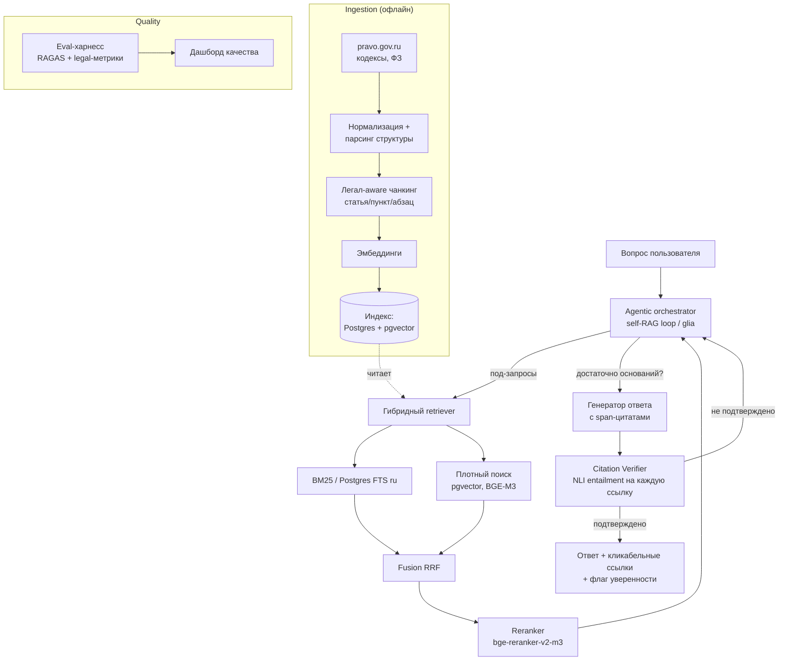

# Архитектура Praxis

Принцип: **retrieval и проверяемость — первичны, генерация — вторична.** В 2026
~73% провалов RAG случаются на этапе поиска, а в легал-домене цена галлюцинации
максимальна. Поэтому центр тяжести системы — качественный ретривер + Citation
Verifier, а LLM только формулирует ответ поверх уже проверенных оснований.

## Поток данных



## Компоненты

### 1. Ingestion (офлайн-пайплайн)
- **Источники:** официальные машиночитаемые тексты кодексов и ФЗ (pravo.gov.ru).
- **Нормализация:** единая модель документа → `Акт → Статья → Часть/Пункт → Абзац`,
  с сохранением реквизитов (номер, дата, редакция) — это метаданные для точной цитаты.
- **Легал-aware чанкинг:** режем **по структурным единицам, а не по токенам**.
  Единица цитирования в праве — пункт/часть статьи, а не «512 токенов». Это
  напрямую повышает точность и делает ссылку осмысленной («ст. 431 ГК РФ, п. 2»).
- **Версионирование:** редакции норм меняются; чанк хранит период действия.

### 2. Индекс и хранилище
- **Postgres + pgvector** — один стор для метаданных, полнотекста (FTS с русской
  конфигурацией) и плотных векторов. Меньше движущихся частей для v1; масштаб —
  позже (Qdrant/Elasticsearch при необходимости).
- Гибрид оправдан: BM25 ловит точные формулировки и номера статей, dense — смысл.

### 3. Retriever
- **Hybrid:** BM25/FTS + dense (BGE-M3, multilingual) → **RRF-fusion** → топ-N.
- **Rerank:** cross-encoder `bge-reranker-v2-m3` по топ-N → топ-k. Двухстадийность
  даёт основной прирост Recall (по бенчмаркам ~+17% к Recall@5 против чистого hybrid).

### 4. Agentic orchestrator (self-RAG)
- Луп на **glia** (прозрачный, без скрытой магии — совпадает с философией либы):
  `план → поиск → оценка достаточности → доп-поиск/переформулировка → генерация`.
- Останавливается, когда набрано достаточно подтверждённых оснований **или**
  честно сообщает, что ответа в законе нет.

### 5. Citation Verifier (ядро доверия)
- Для каждого «тезис ↔ процитированная норма» гоняем **NLI-проверку entailment**
  (RU/multilingual NLI-модель на GPU; LLM-судья как fallback/ансамбль).
- Возможные вердикты: `подтверждает` / `не относится` / `противоречит`.
- Неподтверждённые тезисы **не выдаются как факт** — либо удаляются, либо
  помечаются как «требует проверки». Это то, что отличает продукт от игрушки.

### 6. Генерация
- LLM формулирует ответ **только по извлечённым и проверенным** фрагментам,
  каждое утверждение обязано нести span-ссылку. Pluggable-провайдер
  (Claude по умолчанию для качества; GigaChat/YandexGPT для сценариев резидентности).

### 7. Eval-харнесс + дашборд
- **Метрики:** faithfulness (≥0.9 цель), citation precision/recall, context
  precision, answer relevancy; свои легал-метрики (доля непроверенных цитат,
  корректность реквизитов). Инструменты: RAGAS + кастом.
- **Golden set:** ~100–200 реальных юр-вопросов с эталонными нормами.
- **Регрессии:** прогон на каждом релизе; drift-мониторинг через **mlango**.

## Раскладка репозитория (план)

```
praxis/
├── README.md
├── ARCHITECTURE.md
├── pyproject.toml
├── docker-compose.yml
├── src/praxis/
│   ├── ingest/         # источники, statute_parser, json_loader, чанкинг
│   ├── index/          # pgvector + FTS, схема
│   ├── embed/          # BGE-M3 + hashing fallback
│   ├── retrieve/       # BM25 + dense + hybrid RRF
│   ├── rerank/         # cross-encoder BGE + лексический fallback
│   ├── graph/          # GraphRAG по перекрёстным ссылкам норм
│   ├── verify/         # Citation Verifier: NLI + эвристика
│   ├── llm/            # Claude + Mock
│   ├── generate/       # экстрактивный / LLM генератор со span-цитатами
│   ├── agent/          # self-RAG луп (трейс)
│   ├── eval/           # golden set, метрики, HTML-дашборд
│   ├── api/            # FastAPI + веб-UI
│   ├── pipeline.py     # build_pipeline(): фабрика real/fallback
│   ├── runtime.py      # PRAXIS_OFFLINE переключатель
│   └── core/           # доменные модели: Акт/Статья/Норма/Цитата/Ответ
├── web/                # минимальный UI (позже)
└── tests/
```

## Ключевые архитектурные ставки

1. **Структурный чанкинг вместо токенного** — потому что единица права = пункт статьи.
2. **Проверка цитат как отдельный обязательный шаг** — доверие важнее «красивого» ответа.
3. **Один Postgres на старте** — минимум инфраструктуры, быстрый путь к рабочему v1.
4. **Догфудинг glia + mlango** — продукт заодно проверяет и усиливает экосистему DrobyshevDev.
5. **Домен-портируемость** — модель `Акт→Норма→Цитата` абстрактна; EU/US-корпус подключается тем же интерфейсом.

## Клиенты и открытый API

Одно API-ядро (FastAPI, версия `/v1`) — общая основа для всех клиентов. Логика (ретривер,
Citation Verifier, self-RAG) живёт в ядре, клиенты остаются тонкими.

- **Веб-UI** — есть, отдаётся тем же сервисом на `/`.
- **Desktop** (роадмап) — тонкий клиент (Tauri/Electron) поверх `/v1`, с офлайн-режимом на
  локальных моделях и локальном корпусе.
- **Mobile** (роадмап) — нативный или кроссплатформенный клиент на тот же API.
- **Открытый API для ML-специалистов** — `/v1/ask`, `/v1/search`, CORS, OpenAPI-схема на
  `/openapi.json`, Python-клиент в `clients/python/`. Поиск и проверку цитат можно
  переиспользовать как сервис. Подробности — [docs/API.md](docs/API.md).

Такое разделение даёт резидентность: корпус и модели разворачиваются локально, наружу
торчит только API.
